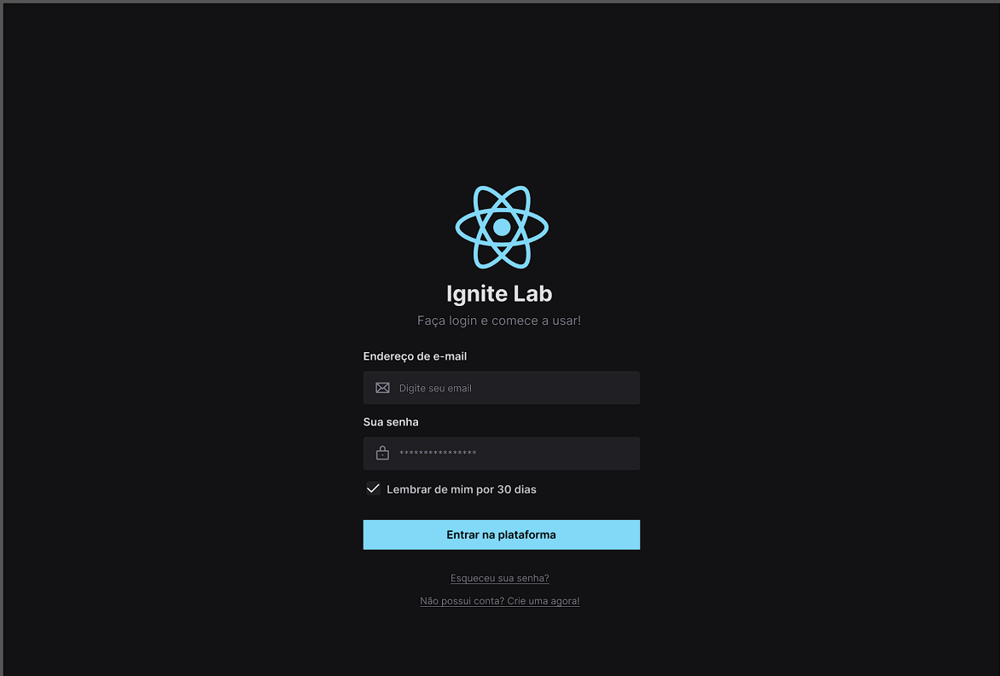
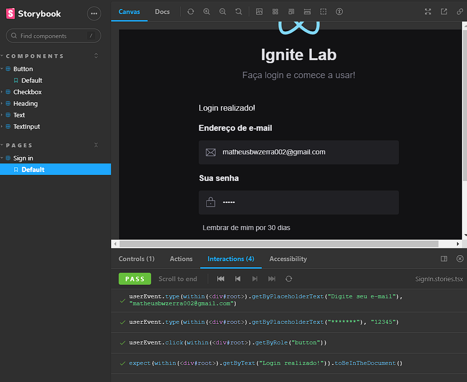

<h1 align="center">
 
    Desygn System ( Ignite Lab )
 
</h1>

  Foi criado um projeto com foco no Design System ( padrões de design da sua marca nos projetos criados ), com objetivo de fazer esse estudo com as principais ferramentas mais atuais para se utilizar, facilitando a criação do design system da marca (Figma, Storybook, testes....).
   
  O deploy da documentação do storybook dos componentes da aplicação, foi hospedado no Github Pages usando CI/CD automatizado. <a href="https://matheus-bezerra.github.io/DesygnSystem/?path=/story/components-button--default">Link dos componentes no Storybook</a>

  

    
    

## <a href="https://matheus-bezerra.github.io/DesygnSystem/?path=/story/components-button--default">Link dos componentes no Storybook</a>
 

## Tecnologias

O projeto foi desenvolvido com as seguintes Tecnologias:

- React
- Typescript
- Storybook
- Testes (unitários do com Jest)
- MSW
- Addons de usabiidade e testes para Storybook
- Radix UI
- Tailwind CSS
- CI/CD
- Github Pages

---

Feito por Matheus Bezerra, entre em contato pelo Linkedin --> <a href="https://www.linkedin.com/in/matheus-bezerra04/">Matheus-Bezerra04</a>

Ou entre em contato pelo Numero (11) 97661-1929

